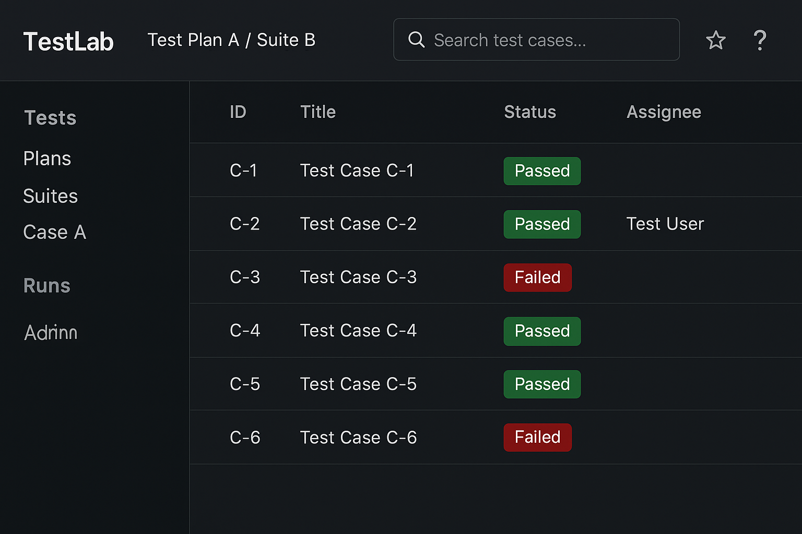
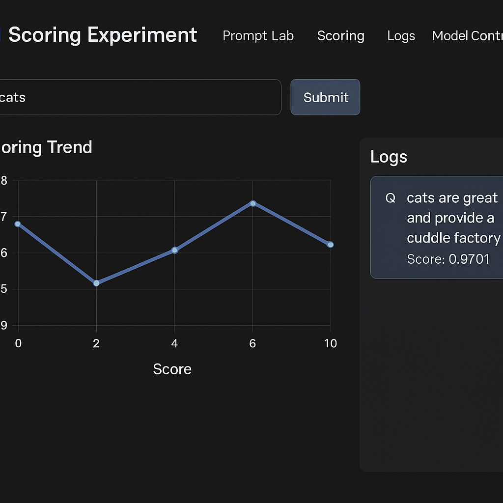

📄 For full system overview, see [README.md](../README.md)

Welcome to the **PromptPal AI Platform** — a system-level AI project showcasing advanced architecture, algorithms, and deployment for intelligent prompt evaluation and management.

This guide outlines how to contribute effectively and maintain the project's high standards of reliability, scalability, and performance.

---

## 📚 Table of Contents
- [🎮 Project Goals](#-project-goals)
- [🚮 Project Structure](#-project-structure-high-level)
- [🛠️ Contribution Types](#️-contribution-types)
- [🤠 Suggested First Contributions](#-suggested-first-contributions)
- [🪠 Local Contribution Testing Guide](#-local-contribution-testing-guide)
- [🛡️ Environment Configuration](#️-environment-configuration)
- [👤 Maintainer](#-maintainer)
- [🔗 Key Modules to Explore](#-key-modules-to-explore)
- [🚨 Pull Request Guidelines](#-pull-request-guidelines)
- [🌍 Code of Conduct](#-code-of-conduct)
- [🏆 Recognition](#-recognition)
- [🚀 Final Words](#-final-words)
- [🔖 Screenshots](#-screenshots)
- [🗕️ Live Demo](#️-live-demo)
- [🏫 Real-World Usage Examples](#-real-world-usage-examples)
- [🚀 CLI Example](#-cli-example)
- [🧰 Makefile Support](#-makefile-support)
- [📁 License](#-license)
- [📑 Citation](#-citation)

---

## 🎮 Project Goals

PromptPal AI Platform aims to address a growing need for reliable and scalable prompt evaluation pipelines in large language model (LLM) applications. This project showcases:

* 🧠 **System-level architecture** with support for distributed task handling, model orchestration, and logging
* ⚙️ **Reproducible and optimized ML workflows**, including distillation, quantization, and scoring logic
* 🚀 **Full-stack deployment** with Docker, Kubernetes, and GitOps (ArgoCD)
* 📈 **Rich UI dashboards** for score visualization, analytics, and audit logging

> This platform is more than a demo — it's a blueprint for real-world AI infrastructure.
> By integrating prompt evaluation, DevOps, observability, and reproducibility, PromptPal demonstrates how to build maintainable, scalable, and production-grade AI systems — the exact capabilities top companies seek in engineers and researchers.

---

## 🚮 Project Structure (High-Level)

## 🏗 Project Structure (High-Level)

promptpal/
├── docs/                # Architecture, screenshots, contribution guides
├── github/              # GitHub-related workflows (CI/CD configs)
├── node_modules/        # Installed dependencies
├── public/              # Frontend static assets
├── server/              # Backend services (API routes, models)
├── src/                 # Core logic (scoring, charts, middleware)
├── static/              # Additional static assets
├── .gitignore           # Git ignore file
├── ascii_render.py      # Utility script for ASCII rendering (fun feature)
├── package.json         # Node.js dependencies & scripts
├── package-lock.json    # Lockfile for exact dependency versions
├── README.md            # Main documentation entry

---

## 🛠️ Contribution Types

| Type                       | Description                                                              |
| -------------------------- | ------------------------------------------------------------------------ |
| 🔧 Feature Improvements    | Enhance scoring algorithm, prompt handling, or multi-model support       |
| 🚀 Deployment Enhancements | Improve container orchestration, monitoring (e.g., Prometheus/Grafana)   |
| 🥢 Testing & CI            | Strengthen E2E (Cypress), integration tests, or GitHub Actions workflows |
| 📈 Visualization UI        | Add charts or dashboard elements (ECharts, Next.js components)           |
| 📘️ Documentation          | Improve architecture diagrams, usage examples, or README sections        |

---

## 🤠 Suggested First Contributions

Not sure where to start? Try one of these:

* 📈 Add a new metric to `src/metrics.ts` and expose it at `/metrics`
* 🥲 Write a Cypress test for prompt scoring flow
* 🌐 Improve i18n support in the frontend UI
* 🐳 Add a `Dockerfile.model` for a new inference backend (e.g., Ollama)

These demonstrate practical system understanding and will help you get familiar with the platform.

---

## 🪠 Local Contribution Testing Guide

To test your contribution locally:

### ✅ Step 1: Run backend + worker
```bash
# Start core services
docker-compose up server worker redis mongo
✅ Step 2: Run frontend UI
cd ui
npm install
npm run dev
✅ Step 3: Test scoring endpoint
curl -X POST http://localhost:3000/api/score \
  -d '{"prompt": "Write a poem."}'
✅ Step 4: View logs
curl http://localhost:3000/api/logs

🛡️ Environment Configuration
This project uses .env files for managing secrets like API keys or DB credentials.
⚠️ Never commit your .env to version control.
See .env.example for reference.

👤 Maintainer
This project is actively maintained by:

Kexin Rong
GitHub | LinkedIn

🔗 Key Modules to Explore
File / Folder	Description
docs/architecture.md	System architecture overview
src/scoring/evaluate.ts	AI prompt scoring engine (modular + testable)
src/charts/scoringChart.ts	Score visualization with ECharts

🚨 Pull Request Guidelines
Before submitting a PR:

Create a new branch (e.g., feat/your-feature)

Include a clear title and description

Link related issues (e.g., Fixes #123)

Ensure all tests pass and coverage does not decrease

Submit only one logical change per PR

🌍 Code of Conduct
All contributors must adhere to our Code of Conduct. Be respectful, constructive, and collaborative.

🏆 Recognition
All merged contributors will be listed in README.md and credited in future demo presentations and publications.

🚀 Final Words
PromptPal is built for those who want to make a meaningful impact in applied AI. Your contributions help drive open, reproducible, and enterprise-ready AI tooling forward.

Let's build the future of AI — one prompt at a time.

🔖 Screenshots
markdown
Copy
Edit




🏫 Real-World Usage Examples
PromptPal has been applied in:

✅ Enterprise Use Case: Automating LLM prompt evaluations for customer support bots with compliance reporting

✅ Research Use Case: Fine-tuning and scoring prompts for pathology-specific GPT models with reproducibility tracking


📁 License
This project is released under the MIT License.

📑 Citation
@misc{promptpal_2025,
  title={PromptPal: A Fully Integrated System-Level AI Platform},
  author={Hui Li},
  year={2025},
  url={https://github.com/casey2346/promptpal}
}